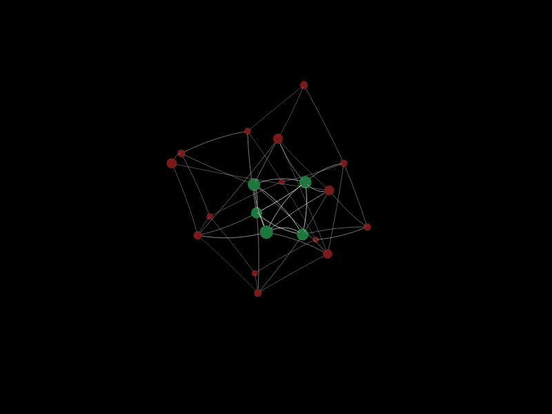
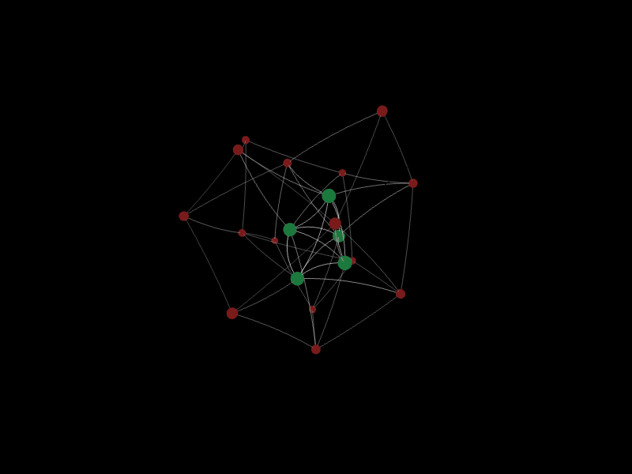
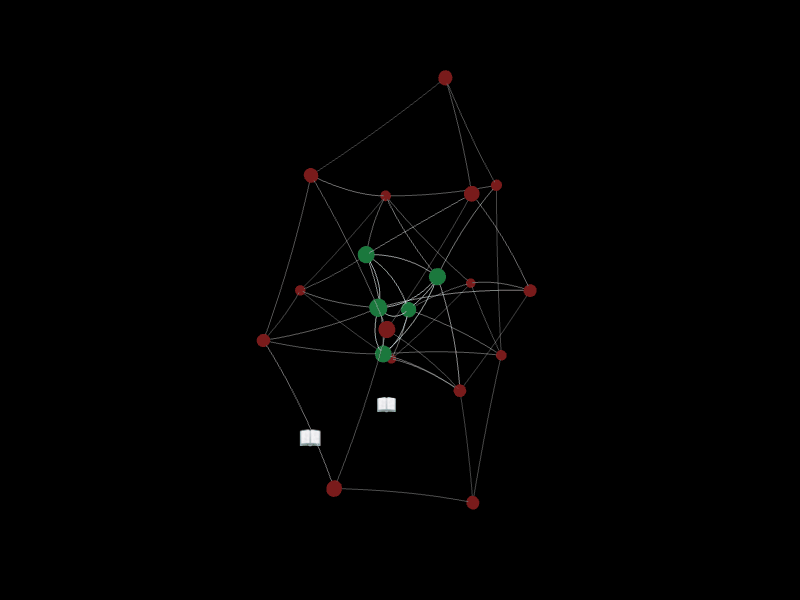
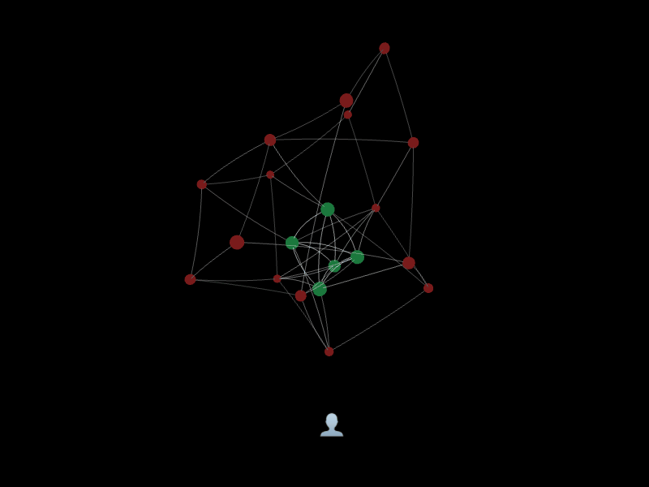
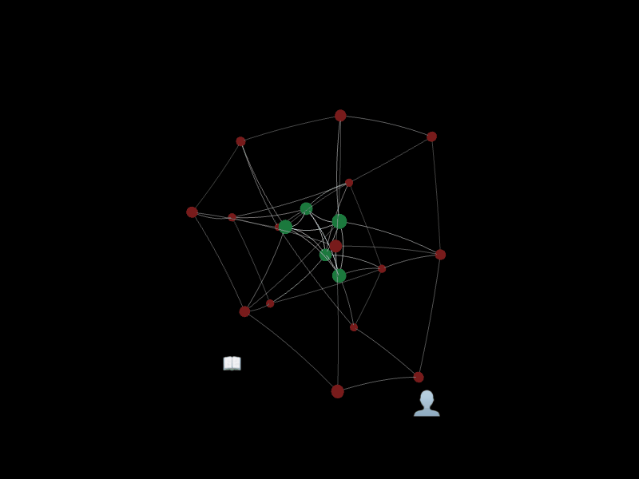
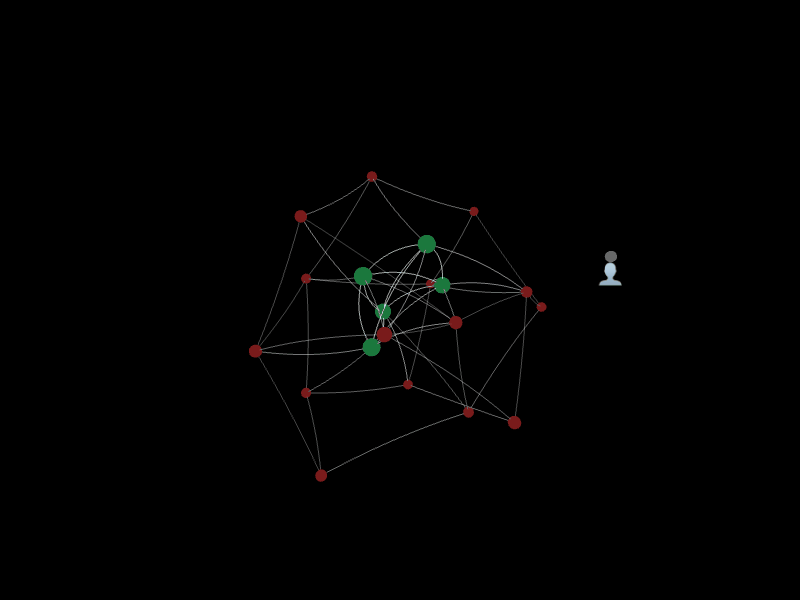
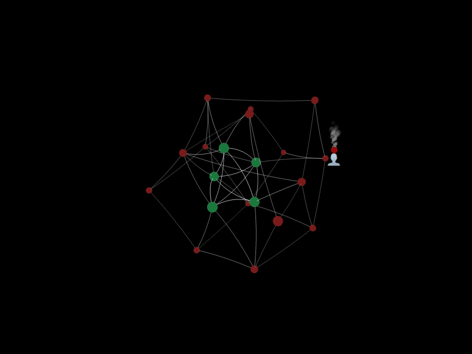
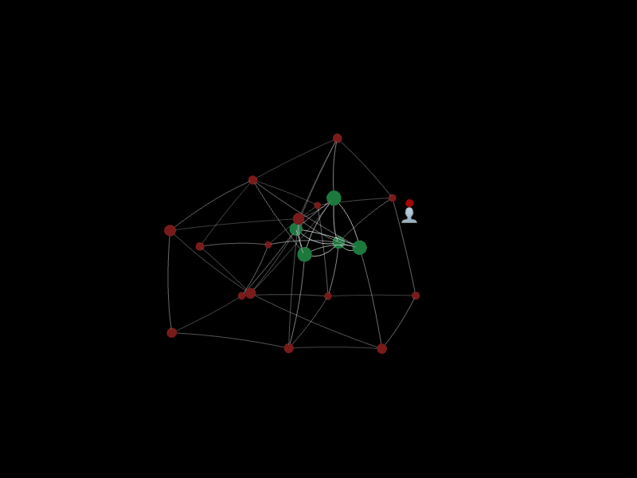

# A B U 3D Visual

Animations exploring A→B→U growth dynamics and maladaptive B patterns.

For context and explanation, see: [A B U gifs, maladaptive Bs, and Kegan's "Immunity to Change"](https://alexislearning.me/scrapbook/2026/A-B-U-gifs,-maladaptive-Bs,-and-Kegan's-%22Immunity-to-Change%22)

---

## Core animations

### Frontier growth

### A to B

### U — snap

### U — fade

### U — filtering

---

## Maladaptive B patterns

### 1. Maladaptive B fires

### 2. Feedback rejected

### 3. Feedback integrated (equal)

### 4. Feedback integrated (dominant)

